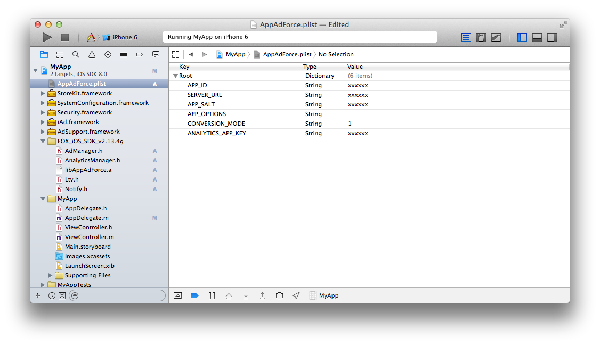

# Force Opetaion Xとは

Force Operation X (以下F.O.X)は、スマートフォンにおける広告効果最適化のためのトータルソリューションプラットフォームです。アプリケーションのダウンロード、ウェブ上でのユーザーアクションの計測はもちろん、スマートフォンユーザーの行動特性に基づいた独自の効果計測基準の元、企業のプロモーションにおける費用対効果を最大化することができます。

本ドキュメントでは、スマートフォンアプリケーションにおける広告効果最大化のためのF.O.X SDK導入手順について説明します。

## F.O.X SDKとは

F.O.X SDKをアプリケーションに導入することで、以下の機能を実現します。

* **インストール計測**

広告流入別にインストール数を計測することができます。

* **LTV計測**

流入元広告別にLife Time Valueを計測します。主な成果地点としては、会員登録、チュートリアル突破、課金などがあります。各広告別に登録率、課金率や課金額などを計測することができます。

* **アクセス解析**

自然流入と広告流入のインストール比較。アプリケーションの起動数やユニークユーザー数(DAU/MAU)。継続率等を計測することができます。

* **プッシュ通知**

F.O.Xで計測された情報を使い、ユーザーに対してプッシュ通知を行うことができます。例えば、特定の広告から流入したユーザーに対してメッセージを送ることができます。

# 1.	概要

本ドキュメントでは、Force Operation X SDK Cocos2d-x プラグインの導入手順について説明します。Force Operation X SDK Cocos2d-xプラグインはiOSおよびAndroidに対応しています。

Force Operation X SDKでは、インストールおよびLTVの計測、アクセス解析を行うことができます。

SDKの実装後は、アプリケーションの動作及び効果測定の結果に問題のないことを確認した後にマーケットへの申請を行ってください。効果測定のテスト手順については、Force Operation X管理者よりご連絡いたします。

## 1.1	SDK仕様

F.O.X SDKをアプリケーションに導入することで、以下の機能を実現します。

|処理|必須|概要|
|:------:|:------:|:------|
|インストール計測|必須|起動時はブラウザが起動し、Cookie計測により広告効果測定を行います。 コンバージョン数、CVRなどを測定することができます。 メソッド名：sendConversion|
|LTV計測|オプション|任意の成果地点で成果通知を行い、広告別の課金数や入会数の計測を行います。 課金金額、退会数などを測定することができます。 メソッド名：sendLtv|
|アクセス解析|オプション|アプリの起動時およびバックグラウンドからの復帰時の起動計測を行います。 起動数、アクティブユーザー数(DAU)、継続率などを測定することができます。 メソッド名：sendStartSession|

> Force Operation X SDK Cocos2d-x プラグインは、ネイティブ版SDKへのブリッジを行うラッパーとして実装しています。SDK導入には、プラグインと、iOS及びAndroidのネイティブ版SDKが必要となります。_

#2.	iOS用 Xcode プロジェクトの設定

##2.1	SDKの展開

ダウンロードしたSDK「FOX_Cocos2dx_SDK_<version>.zip」をOS上に展開します。Classesフォルダ内に同梱されているファイルは以下の通りです。

ファイル名|必須|概要
:--------|:-------------:|:--------:
Cocos2dxFox.h|必須|ヘッダファイル。Cocos2d-xからSDKを使用するためのラッパー
Cocos2dxFox.mm|	iOS専用	|ライブラリファイル。Cocos2d-xからFOX SDKを使用するためのiOS用のラッパー
Cocos2dxFox.cpp|オプション|ヘッダファイル。Cocos2d-xからPush通知を行うためのラッパー
FoxNotifyPlugin.m|オプション|ライブラリファイル。Cocos2d-xからPush通知を行うためのラッパー
FoxVersionPlugin.h|オプション|ヘッダファイル。Cocos2d-xからバンドルバージョンを制御するラッパー
FoxVersionDelegate.m|オプション|ライブラリファイル。Cocos2d-xからバンドルバージョンを制御するラッパー|
FoxVersionPlugin.h|オプション|ヘッダファイル。Cocos2d-xからバンドルバージョンを制御するラッパー|
FoxVersionPlugin.m|オプション|ライブラリファイル。Cocos2d-xからバンドルバージョンを制御するラッパー|
FoxReengagePlugin.h|オプション|ライブラリファイル。Cocos2d-xからURLスキーム経由の起動計測を行うためのラッパー|
FoxReengagePlugin.m|オプション|ヘッダファイル。Cocos2d-xからURLスキーム経由の起動計測を行うためのラッパー|

上記のファイルはラッパーですので、実装ファイルはネイティブSDKを組み合わせます。

以下のファイル群が、iOSのネイティブSDKとなっており「FOX_iOS_SDK_<version>」フォルダに同梱されています。

ファイル名|必須|概要
:--------|:-------------:|:--------:
AdManager.h|必須|ヘッダファイル。広告の効果測定を行う。|
libAppAdForce.a|必須|ライブラリファイル。広告の効果測定を行う。|
Ltv.h|オプション|ヘッダファイル。LTV計測を行う。|
AnalyticsManager.h|オプション|ヘッダファイル。アクセス解析を行う。|
Notify.h|オプション|ヘッダファイル。Push通知を行う。

※「FOX_Cocos2dx_SDK_<version>.zip」に「FOX_iOS_SDK_<version>」フォルダが含まれていない場合は

SDKダウンロードサイトからFOX_iOS_SDK_<version>.zipをダウンロードの上、ご使用ください。

##2.2	ライブラリの組み込み

* Xcodeのメニュー「File」→「Add Files to “XXX”」を選択
* Cocos2dxFox.h、Cocos2dxFox.mmを組み込んでください。Cocos2dxFox.cppはAndroid用ライブラリであるため、追加の必要はありません。
* プッシュ通知機能を使う場合は、FoxNotifyPlugin.h、FoxNotifyPlugin.mの2ファイルを組み込んでください。
* バンドルバージョン判定機能を使う場合は、FoxVersionDelegate.h、FoxVersionDelegate .mmとFoxVersionPlugin.h、FoxVersionPlugin.mmの計4ファイルを組み込んでください。
* リエンゲージメント計測を行う場合はFoxReengagePlugin.hとFoxReengagePlugin.mの2ファイルを組み込んでください。
* 「Copy items into destination group’s folder」にチェック

[ライブラリの組み込み詳細](./doc/integration/ja/README.md)

##2.3 フレームワークの追加

次のフレームワークをプロジェクトにリンクしてください。

<table>
<tr><th>フレームワーク名</th><th>Status</th></tr>
<tr><td>AdSupport.framework</td><td>Optional</td></tr>
<tr><td>iAd.framework </td><td>Required</td></tr>
<tr><td>Security.framework </td><td>Required </td></tr>
<tr><td>StoreKit.framework </td><td>Required </td></tr>
<tr><td>SystemConfiguration.framework </td><td>Required </td></tr>
</table>

> AdSupport.frameworkはiOS 6以降で追加されたフレームワークのため、アプリケーションをiOS 5以前でも動作させる(iOS Deployment Targetを5.1以下に設定する)場合にはweak linkを行うために”Optional”に設定してください。

[フレームワーク設定の詳細](./doc/config_framework/ja/README.md)

##2.4 SDKの設定

SDKの動作に必要な設定をplistに追加します。「AppAdForce.plist」というファイルをプロジェクトの任意の場所に作成し、次のキーと値を入力してください。

<table>
<tr>
  <th>Key</th>
  <th>Type</th>
  <th>Value</th>
</tr>
<tr>
  <td>APP_ID</td>
  <td>String</td>
  <td>Force Operation X管理者より連絡しますので、その値を入力してください。</td>
</tr>
<tr>
  <td>SERVER_URL</td>
  <td>String</td>
  <td>Force Operation X管理者より連絡しますので、その値を入力してください。</td>
</tr>
<tr>
  <td>APP_SALT</td>
  <td>String</td>
  <td>Force Operation X管理者より連絡しますので、その値を入力してください。</td>
</tr>
<tr>
  <td>APP_OPTIONS</td>
  <td>String</td>
  <td>何も入力せず、空文字の状態にしてください。</td>
</tr>
<tr>
  <td>CONVERSION_MODE</td>
  <td>String</td>
  <td>1</td>
</tr>
<tr>
  <td>ANALYTICS_APP_KEY</td>
  <td>String</td>
  <td>Force Operation X管理者より連絡しますので、その値を入力してください。 アクセス解析を利用しない場合は設定の必要はありません。</td>
</tr>
</table>

[SDK設定の詳細](./doc/config_plist/ja/README.md)

[AppAdForce.plistサンプル](./doc/config_plist/AppAdForce.plist)

#3.	Android用 プロジェクトの設定
##3.1	SDKの展開

ダウンロードしたSDK「FOX_Cocos2dx_SDK_<version>.zip」をOS上に展開します。 
「FOX_Android_SDK_<version>」フォルダに同梱されている「AppAdForce.jar」を開発環境に導入します。次に、Eclipseプロジェクトへの導入手順について説明します。

|ファイル名|必須|概要|
|:------:|:------:|:------|
|AppAdForce.jar|必須|AndroidのネイティブSDK。通常成果・LTV成果・アクセス解析を計測することができます。|
|gcm.jar|オプション|プッシュ通知機能を利用する際に導入ください。|

※「FOX_Cocos2dx_SDK_<version>.zip」に「FOX_Android_SDK_<version>」フォルダが含まれていない場合はSDKダウンロードサイトからFOX_Android_SDK_<version>.zipをダウンロードの上、ご使用ください。

##3.2	プロジェクトへの導入

既にアプリケーションにSDKが導入されている場合には、[最新バージョンへのアップデートについて](./doc/update/ja)をご参照ください。

ダウンロードしたSDK「FOX_Android_SDK_<version>.zip」を展開し、「AppAdForce.jar」をアプリケーションのプロジェクトに組み込んでください。

[Eclipseプロジェクトへの導入の方法](./doc/integration/eclipse/ja/)

[AndroidStudioプロジェクトへの導入の方法](./doc/integration/android_studio/ja/)

##3.3 AndroidManifest.xmlの編集
###3.3.1 パーミッションの設定

Force Operation X SDKの実行に必要なパーミッションの設定を<manifest>タグ内に追加します。

	<uses-permission android:name="android.permission.INTERNET" />
	<uses-permission android:name="android.permission.ACCESS_NETWORK_STATE" />

###3.3.2 メタデータの設定
|パラメータ名|必須|概要|
|:------|:------|:------|
|APPADFORCE_APP_ID|必須|Force Operation X管理者より連絡しますので、その値を入力してください。|
|APPADFORCE_SERVER_URL|必須|Force Operation X管理者より連絡しますので、その値を入力してください。|
|APPADFORCE_CRYPTO_SALT|必須|Force Operation X管理者より連絡しますので、その値を入力してください。|
|ANALYTICS_APP_KEY|必須|Force Operation X管理者より連絡しますので、その値を入力してください。|
|APPADFORCE_ID_DIR|オプション|内(外)部ストレージを利用する際、任意の保存するディレクトリ名を指定できます。 未指定の場合、パッケージ名でディレクトリが作成されます。|
|APPADFORCE_ID_FILE|オプション|内(外)部ストレージを利用する際、任意の保存する識別子ファイル名を指定できます。 未指定の場合、”__FOX_XUNIQ__”でファイルが作成されます。|
|APPADFORCE_USE_EXTERNAL_STORAGE|オプション|0を指定した場合、内(外)部ストレージへの保存は実行しません。|

Force Operation X SDKの実行に必要な情報を<application>タグ内に追加します。

	<meta-data android:name="APPADFORCE_APP_ID" android:value="1" />
	<meta-data android:name="APPADFORCE_SERVER_URL" android:value="012345ABC" />
	<meta-data android:name="APPADFORCE_CRYPTO_SALT" android:value="abcdef123" />
	<meta-data android:name="ANALYTICS_APP_KEY" android:value="xxxxxx" />

###3.3.3 インストールリファラー計測の設定
インストールリファラー計測を行うために必要な設定を<application>タグ内に追加します。

	<receiver android:name="jp.appAdForce.android.InstallReceiver" android:exported="true">
		<intent-filter>
			<action android:name="com.android.vending.INSTALL_REFERRER" />
		</intent-filter>
	</receiver>

既に"com.android.vending.INSTALL_REFERRER"に対するレシーバークラスが定義されている場合には、[二つのINSTALL_REFERRERレシーバーを共存させる場合の設定](https://github.com/cyber-z/public_fox_android_sdk/blob/master/doc/install_referrer/ja/README.md)をご参照ください。

###3.3.4 URLスキームの設定
アプリを外部から起動する際に必須となります。起動させる対象の<activity>タグ内に追加します。

例 ”smapleapp://”でアプリを起動させる

	<intent-filter>
		<action android:name="android.intent.action.VIEW" />
		<category android:name="android.intent.category.DEFAULT" />
		<category android:name="android.intent.category.BROWSABLE" />
		<data android:scheme="sampleapp" />
	</intent-filter>

###3.3.5 その他
* [広告IDを利用するためのGoogle Play Services SDKの導入](./doc/google_play_services/ja/)
* [（オプション）外部ストレージを利用した重複排除設定](./doc/external_storage/ja)
* [AndroidManifest.xmlの設定例](./doc/config_androidManifest/ja/AndroidManifest.xml)
	

##3.4 Cocos2d-xプロジェクトのClassesへの導入

「FOX_Cocos2dx_SDK_<version>.zip」を展開し、以下の操作を行います。

* Android/Classes配下のCocos2dxFox.hとCocos2dxFox.cppをプロジェクト配下のClassesへコピー
* プロジェクト内配下のjni/Android.mkにCocos2dxFox.cppファイルを追記し、ビルドの対象に含める 
　→ LOCAL_SRC_FILESにClasses/Cocos2dxFox.cppの指定を追加してください。

　
Cocos2dxFox.cppのJniHelper.hのincludeパスを開発環境に合わせる（以下はその例）

	#include <iostrem>
	#inclued “cocos2d.h”
	#include “Cocos2dxFox.h”
	#include “../android/jni/JniHelper.h”

##3.5 カスタムURLスキーム経由の起動計測設定

Androidプロジェクトにおいて、カスタムURLスキーム経由の起動を計測するために、ActivityのonResume()にコードを追加します。また、AndroidManifest.xmlのメインとなるActivityにURLスキーム指定が設定されていることが前提となります。

クラスをインポート

	import jp.appAdForce.android.cocos2dx.Cocos2dxAdManager;
	
アプリケーション起動時の起動計測（MainActivityクラスへの実装例）

	public class MainActivity extends Cocos2dxActivity {
	
		@Override
		protected void onResume() {
			super.onResume();
			Cocos2dxAdManager.sendConversionWithUrlScheme(this);
		}
	}

#4 インストール計測の実装
##4.1 インストールの計測

初回起動のインストール計測を実装することで、広告の効果測定を行うことができます。初回起動時に、ブラウザを起動し、広告クリック時に付与されたCookieの情報を照合することで、成果の計測を行います。

初回起動時にブラウザを起動するために、AppDelegate:applicationDidFinishLaunching:メソッド等、アプリケーションの起動時に必ず呼ばれる箇所に効果測定用の処理を追加します。

ヘッダファイルをインクルード

	#include "Cocos2dxFox.h"
	
成果通知のコードを追加

	FoxPlugin::sendConversion(“http://example.com”);
	
> ※Android Cocos2dx SDK v2.10.4g以前の海外版/グローバル版SDK (バージョン末尾が u しくは g)からSDKをアップデートをする場合、必ず「v2.10.4g以前からのアップデート手順」の手順を追加してください。

sendConversion:メソッドの引数には、アプリ起動後に表示するURLを指定してください。

> ※自身のURLスキームを設定することで、ブラウザ起動後すぐにアプリケーションに戻る動作とすることもできますが、URLスキームを指定した場合にはHTMLページを経由しないため、HTML計測タグに対応できず、タグによる計測が必要となった際にアプリの更新が必要となるデメリットがありますので、HTMLページをご用意いただくことを推奨します。

sendConversionメソッドの第二引数に広告主端末IDを渡すことができます。例えば、アプリ起動時にUUIDを生成し、初回起動の成果と紐付けて管理したい場合等に、利用できます。

	FoxPlugin::sendConversion(“http://○○○○”, “your unique id”);
	
> ※sendConversionは起動直後の処理として実装いただくため、ログインIDなどを引数として渡すことはできません。

#5 LTV計測の実装

LTV計測により、広告流入別の課金金額や入会数などを計測することができます。計測のために、任意の地点にLTV成果通信を行うコードを追加します。

ソースの編集は、成果が上がった後に実行されるスクリプトに処理を記述します。例えば、会員登録やアプリ内課金後の課金計測では、登録・課金処理実行後のコールバック内にLTV計測処理を記述します。

成果がアプリ内部で発生する場合、成果処理部に以下のように記述してください。

ヘッダをインクルード

	#include “Cocos2dxFox.h”

成果を記述

	FoxPlugin::sendLtv(成果地点ID);

> 成果地点ID(必須)：管理者より連絡します。その値を入力してください。
※Android Cocos2dx SDK v2.10.4g以前の海外版/グローバル版SDK (バージョン末尾が u しくは g)からSDKをアップデートをする場合、必ず「v2.10.4g以前からのアップデート手順」の手順を追加してください。


アプリ内部の成果に、広告主端末ID（会員IDなど）を含める事ができ、これを基準とした成果計測が行えます。LTV成果に広告主端末IDを付与したい場合は以下のように記述してください。
	FoxPlugin::sendLtv(成果地点ID, "広告主端末ID");
	
> 成果地点ID(必須)：管理者より連絡します。その値を入力してください。
広告主端末ID(オプション)：広告主様が管理しているユニークな識別子（会員IDなど）です。
指定できる値は64文字以内の半角英数字です。

アプリ内計測時には、パラメータをオプションとして設定する事が可能です。

	FoxPlugin::addParameter("パラメータ名", "値");

指定できるパラメータは次の通りです。

|パラメータ名|概要|
|:------|:------|
|CC_LTV_PARAM_SKU|Stock Keeping Unit(商品管理コード) （半角英数字32文字まで） 商品の在庫管理する際に使用してください|
|CC_LTV_PARAM_PRICE|Price （整数値　日本円） 売上額を管理する際に使用してください。|
|CC_LTV_PARAM_CURRENCY|Currency （半角英字3文字の通貨コード） 通貨別で課金額を集計する際に使用してください。 通貨が設定されていない場合、PriceをJPY(日本円)として扱います。|
|任意でパラメータを加える事も可能です。|FoxPlugin::addParameter(“パラメータ名”, “値”); ※1 同一パラメータ名を記述した場合は、後者が有効となります。 ※2 アンダースコア（"_"）をパラメータ名の先頭に記述しないでください。 ※3 半角英数字以外は使用できません。|

設定例：

	FoxPlugin::addParameter(CC_LTV_PARAM_SKU, “ABC1234”);
	FoxPlugin::addParameter(CC_LTV_PARAM_PRICE, “2000”);
	FoxPlugin::addParameter(“my_param”, “ABC”);
	FoxPlugin::sendLtv(70, “Taro”);

#6 アクセス解析

アクセス解析を導入することで、自然流入・広告流入別の起動数、アクティブユーザー数(DAU/MAU)や継続率を計測することができます。アクセス解析では、アプリケーションが起動、もしくはバックグラウンドから復帰する際にセッション計測を行うコードを追加します。

##6.1 起動計測の実装

####iPhone プロジェクト
iPhoneの場合、以下の設定が必要です。

アプリ起動地点のapplicationDidFinishLaunchingおよびapplicationWillEnterForegroundの両方に、以下のように記述してください。

	FoxPlugin::sendStartSession();
	
####Android プロジェクト
Androidの場合、以下の設定が必要です。

アプリケーションの起動及び、バックグラウンドからの復帰を計測するために、ActivityのonResume()にコードを追加します。

クラスをインポート

	import jp.appAdForce.android.AnalyticsManager;
	
アプリケーション起動時の起動計測（MainActivityクラスへの実装例）

	public class MainActivity extends Activity {

		@Override
		protected void onResume() {
				super.onResume();
			AnalyticsManager.sendStartSession(this);
		}
	}

＜JavaのActivity上でonResume()が使えない場合＞

アプリ起動地点のapplicationDidFinishLaunchingおよび、applicationWillEnterForeground 内で以下のように実行します。

	#include “Cocos2dxFox.h”
	
---
	
	FoxPlugin::sendStartSession();
	
> ※アプリケーションがバックグラウンドから復帰した際に、そのActivityに起動計測の実装がされていない場合など、正確なアクティブユーザー数が計測できなくなります。 
※JavaのonResume()とC++のapplicationWillEnterForegroundの両方でsendStartSession()が実行されていた場合、１ユーザーから２重にアプリ起動情報が送信されるため必ずどちらかで実装してください。

##6.2 課金イベントトラッキング

本機能では広告経由および自然流入経由での売上をそれぞれ計測可能です。

※広告経由の売上のみを計測したい場合はLTV計測で計測可能ですので本機能の実装は必要ありません。 
※主に自然流入経由の売上を計測したい場合などに本機能を実装してください。

|パラメータ|タイプ|最大長|必須|概要|
|:---|:---:|:---:|:---:|:---|
|eventName|String|255|必須|トラッキングを行うイベントを識別できる任意の名前を設定します。 イベント名は自由に設定可能です。 イベント単位でグルーピングされ、それぞれのイベントごとに集計を行うことができます。|
|action|String|255|オプション|イベントに属するアクション名を設定します。 アクション名は自由に設定可能です。 各イベントをドリルダウンすることで、アクションごとに集計を行うことができます。 特に指定しない場合は””を設定してください。|
|label|String|255|オプション|アクションに属するラベル名を設定します。 ラベル名は自由に設定可能です。 各アクションをドリルダウンすることで、ラベルごとに集計を行うことができます。 特に指定しない場合は””を設定してください。|
|orderID|String|255|オプション|注文番号。特に指定いない場合は""を設定してください。|
|sku|String|255|オプション|商品コード。特に指定しない場合は””を設定してください。|
|itemName|String|255|必須|商品名|
|price|double||必須|商品単価|
|quantity|int||必須|購入数|
|currency|String||オプション|通貨コード。指定しなかった場合は"JPY"|

以下のように記述してください

	FoxPlugin::sendEvent(eventName, action, label, orderId, sku, itemName, price, quantity, currency);


#7 AndroidプロジェクトでProGuardを利用する場合

ProGuardを利用してF.O.X SDKを導入したアプリケーションを難読化する際に、警告が発生する場合があります。その際には、警告を回避するため以下の設定を追加してください。

	-libraryjars libs/AppAdForce.jar
	-keep interface jp.appAdForce.** { *; }
	-keep class jp.appAdForce.** { *; }
	-keep class jp.co.dimage.** { *; }
	-keep class com.google.android.gms.ads.identifier.* { *; }
	-dontwarn jp.appAdForce.android.ane.AppAdForceContext
	-dontwarn jp.appAdForce.android.ane.AppAdForceExtension
	-dontwarn com.adobe.fre.FREContext
	-dontwarn com.adobe.fre.FREExtension
	-dontwarn com.adobe.fre.FREFunction
	-dontwarn com.adobe.fre.FREObject
	-dontwarn com.ansca.**
	-dontwarn com.naef.jnlua.**

※GooglePlayServiceSDKを導入されている場合、以下のページで記載されているkeep指定が記述されているかご確認ください。

[Google Play Services導入時のProguard対応](https:/developer.android.com/google/play-services/setup.html#Proguard)


#8 疎通テストの実施

マーケットへの申請までに、Force Operation Xを導入した状態で十分にテストを行い、アプリケーションの動作に問題がないことを確認してください。

効果測定テストの手順については、管理者よりご連絡いたしますのでその手順に従いテストを実施してください。

成果のための通信は、起動後に一度のみ行わるため、二回目以降の起動では通信が発生しません。続けて効果測定テストを行いたい場合には、アプリケーションをアンインストールし、再度インストールから行ってください。

##8.1 テストの手順

SDKが正常に導入されていることを確認するためのテスト手順は以下の通りです。
ProGuardを掛けてリリースを行う場合、必ずProGuardを掛けた状態でテストの実施をお願い致します。

1. テスト用端末にテストアプリがインストールされている場合には、アンインストール
2. テスト用端末の「設定」→「Safari」→「Cookieとデータを消去」によりCookieを削除
3. 弊社より発行したテスト用URLをクリック 
   ※ テスト用URLは必ずOSに設定されているデフォルトブラウザでリクエストされるようにしてください。
デフォルトブラウザとは、URLをクリックした際に自動で起動するブラウザのことです。
メールアプリやQRコードアプリを利用され、そのアプリ内WebViewで遷移した場合には計測できません。
4. マーケットへリダイレクト 
   ※ テストURLの場合には、遷移先がなくエラーダイアログが表示される場合がありますが、問題ありません。
5. テスト用端末にテストアプリをインストール
6. アプリを起動、ブラウザが起動 
   ※ ここでブラウザが起動しない場合には、正常に設定が行われていません。
設定を見直していただき、問題が見当たらない場合には弊社へご連絡ください。
7. LTV地点まで画面遷移
8. アプリを終了し、バックグラウンドからも削除
9. 再度アプリを起動
10. 弊社へ3,6,7,9の時間をお伝えください。正常に計測が行われているか確認致します。
11. 弊社側の確認にて問題がなければテスト完了となります。

#9 その他機能の実装

* [プッシュ通知の実装](./doc/notify/ja/)


#10 最後に必ずご確認ください（これまで発生したトラブル集）

###URLスキームの設定がされずリリースされたためブラウザからアプリに遷移ができない

Cookie計測を行いブラウザを起動した場合には、URLスキームを利用してアプリケーションに遷移します。

この際、独自のURLスキームが設定されている必要があります。


###URLスキームに大文字が含まれ、正常にアプリに遷移されない

環境によって、URLスキームの大文字小文字が判別されないことにより正常にURLスキームの遷移が行えない場合があります。

URLスキームは全て小文字で設定を行ってください。


###F.O.Xで確認できるインストール数の値がマーケットの数字より大きい

F.O.Xではいくつかの方式を組み合わせて端末の重複インストール検知を行っています。重複検知が行えない設定では、同一端末で再インストールされる度にF.O.Xは新規のインストールと判定してしまいます。重複検知の精度を向上するために、以下の設定を行ってください。

* [広告IDを利用するためのGoogle Play Services SDKの導入](./doc/google_play_services/ja/)

* [（オプション）外部ストレージを利用した重複排除設定](./doc/external_storage/ja)

